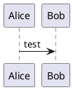

### Transfer task 1
# Laying ground work

## Goal

After this task you can

* understand Docker so we can use it later on
* apply C4 UML (with PlantUML)

## ExMan Suite
The ExMan Suite was introduced in RME as the subject-spanning exercise of the NDS HF SWE. The Suite contains a Packer Service (known to the students as ExManRest.jar).
In SWD/SWT we are wiring the packer to our context.

We get
* functional requirements from Requirements Engineering
* quality requirements from Cloud Computing
* requirements towards our API design from Web Engineering

These we will convert in a modern cloud stack capable solution. We will learn how to develop an application using

* Domain Driven Design
* C4 Model Language
* DevOps incl. CI and CD (partially only as example solution)
* Design patterns
* Code (☕️ Java)
* Light operational approaches to **run and operate** our app

and all of this continuously tested ✔!

### Packer
The packer has been dockerized and uploaded (due to copytights) to a private repository: https://github.com/mambax/abb-nds-hf-swe-exman1

Ask for access by sending an e-mail with your GitHub handle to my [doz address](mailto:dominik.meyer@doz.abbts.ch).

In the [packer repo](https://github.com/mambax/abb-nds-hf-swe-exman1) you find the necessary docs around the packer.

---

- [ ] Request access then inspect the packer

You have met in other contexts before [Docker](https://www.docker.com/). A key skill of software engineers is to read existing code and docs. We start today 📚

#### Get access
Request access as described above, processing the email won't take long.

#### Understand
Browse the repository and answer the following questions:

1. Give a glance at the [Docker docs](https://docs.docker.com/)
2. What does [this line (Line 3 of `Dockerfile`)](https://github.com/mambax/abb-nds-hf-swe-exman1/blob/16ee8f45014d8fa056a0aa55b5812eb784cb771e/Dockerfile#L3) do?
3. What does `EXPOSE 80` in the `Dockerfile` do?
4. Describe in 3 bullet points how the file `ExManRest.jar` has been made executable as a Docker container.

#### Make Docker ready
Many of the tasks you can complete way faster if you have docker installed. Install `docker` for your platform (read the docs) and execute 

```shell
docker version
```
you should see something like

```text
Client: Docker Engine - Community
 Cloud integration: 1.0.7
 Version:           20.10.2
 API version:       1.41
 Go version:        go1.13.15
 Git commit:        2291f61
 Built:             Mon Dec 28 16:12:42 2020
 OS/Arch:           darwin/amd64
 Context:           default
 Experimental:      true

Server: Docker Engine - Community
 Engine:
  Version:          20.10.2
  API version:      1.41 (minimum version 1.12)
  Go version:       go1.13.15
  Git commit:       8891c58
  Built:            Mon Dec 28 16:15:28 2020
  OS/Arch:          linux/amd64
  Experimental:     true
 containerd:
  Version:          1.4.3
  GitCommit:        269548fa27e0089a8b8278fc4fc781d7f65a939b
 runc:
  Version:          1.0.0-rc92
  GitCommit:        ff819c7e9184c13b7c2607fe6c30ae19403a7aff
 docker-init:
  Version:          0.19.0
  GitCommit:        de40ad0
```

‼️ I can not stress enough how important it proves in 2021 that an Engineer can run a simple docker container!

#### Experiment

Having docker ready, how about swiftly running an alpine Linux? It does not matter which platform you run, you can have a linux in like 15 seconds. Try:

```shell
docker run -ti --rm ubuntu:20.04
```

This will open an `-i`nteractive docker that you can now work in. Try some UNIX commands, like these:

```text
docker run -ti --rm ubuntu:20.04
root@e7f19624eb29:/# dir
bin  boot  dev	etc  home  lib	lib32  lib64  libx32  media  mnt  opt  proc  root  run	sbin  srv  sys	tmp  usr  var
root@e7f19624eb29:/# pwd
/
root@e7f19624eb29:/# echo "I run in docker"
I run in docker
root@e7f19624eb29:/# ^C
root@e7f19624eb29:/# exit
exit
```

As a closer, tell me what the arguments `-ti` ad `-rm` just did.

---

🎉 Congratulations, you just laid an important milestone for the rest of the work we are going to do. You can complete the module without docker, but as you read here and as you will see in the course, it just makes your life so much easier.

Also, 98% of the modern cloud run on some form of container solution, so it is about time to hop on the train!

## Converting requirements

The next part of the task is more conceptually oriented.

### UML
Everyone has heard the word UML. Many have studied the theory of UML. Some use UML at work. Few master UML. There are cases where the most exact UML is needed (medical, security etc.) but for most of an engineers work, UML is not the #1 choice for these reasons:

* Few master it, some annotations are just so elaborate you need a special course to read it
* Few can read it
* It is mostly deprecated at creation

### C4 Modelling
You got to know the [C4 Model](https://c4model.com/) in the lecture. We will leverage it to draw out the requirements from the other disciplines.

### PlantUML
Now, as mentioned many times, we need everything as code. Having something not as code in Software Engineering hammers one more nail into the coffin.
We therefore look at https://plantuml.com. It is a Java Executable that allows you to generate diagrams from code!

---

- [ ] Render a simple diagram

Really, it pays off to render diagrams from code! So in this task we learn how to do exactly this.

> Note: You can complete the module without diagrams as code, but one day you might remember this task and wish you tried, promise.

#### Exploring
They have an online server, [try it out for like 10 minutes](http://www.plantuml.com/plantuml).

#### Starting
[Install PlantUML](https://plantuml.com/starting) and run PlantUML from the command line or glance at the next step.

#### Combine our two tasks

In task 1 you got to know docker and in task 2 a library that runs on Java. Was it annoying to install PlantUML locally? **YES!**.

Of course you can run PlantUML in a docker container, you can hand a file into the container and get a picture out!

```shell
cat file.puml | docker run --rm -i think/plantuml -tpng > picture.png
```

To hand a file to the container, create a file and past the example in it:



#### C4 library
While PlantUML is powerful, it does not look too great to be honest. Others agree and that is why there is https://github.com/plantuml-stdlib/C4-PlantUML.

Create another file and render it!

```puml
@startuml C4_Elements
!include https://raw.githubusercontent.com/plantuml-stdlib/C4-PlantUML/master/C4_Container.puml

Person(personAlias, "Label", "Optional Description")
Container(containerAlias, "Label", "Technology", "Optional Description")
System(systemAlias, "Label", "Optional Description")

Rel(personAlias, containerAlias, "Label", "Optional Technology")
@enduml
```

Upload this image as your result and this is the end of your task for now!

---